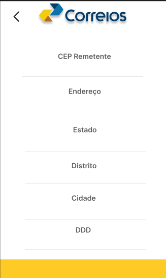
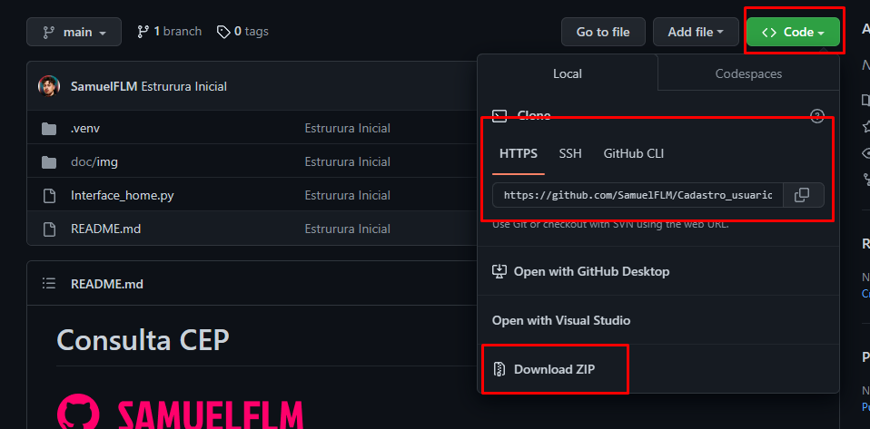
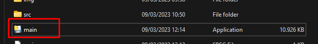

# Consulta CEP

<!---Esses são exemplos. Veja https:/shields.io para outras pessoas ou para personalizar este conjunto de escudos. Você pode querer incluir dependências, status do projeto e informações de licença aqui--->


> Um software de consulta cep.<br>
> Projeto foi pensando e desenvolvido com o proposito de praticar e aplicar conceitos tecnicos de programacao.<br> Sem Fins lucrativos ou algo para prejudicar a marca..




### Como Utilizar? 

```shell
Primeiramente realizar download do projeto..
Executar main
Adicionar o cep referente a consulta e pronto.
```

### Como Usar localmente

```shell
Realizar download via git clone ou zip
```


```shell
Executar o main
```
